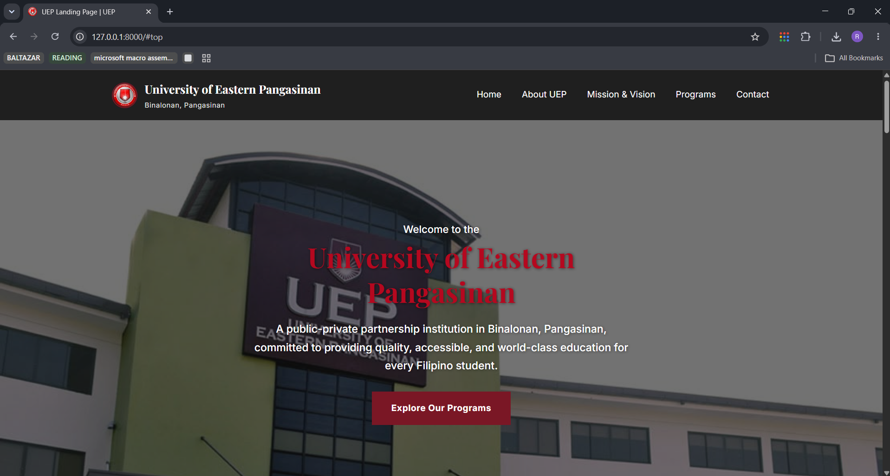
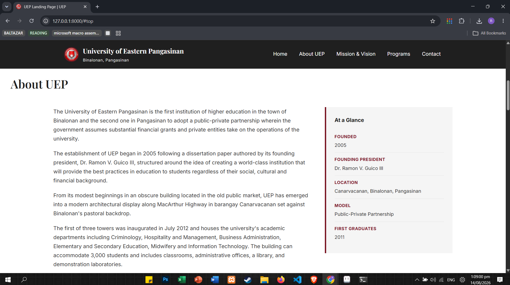
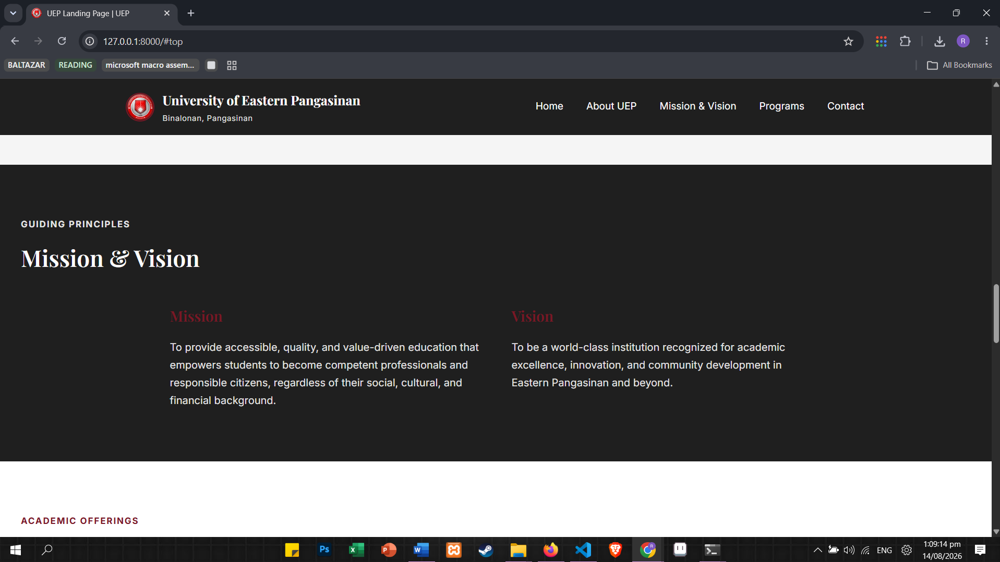
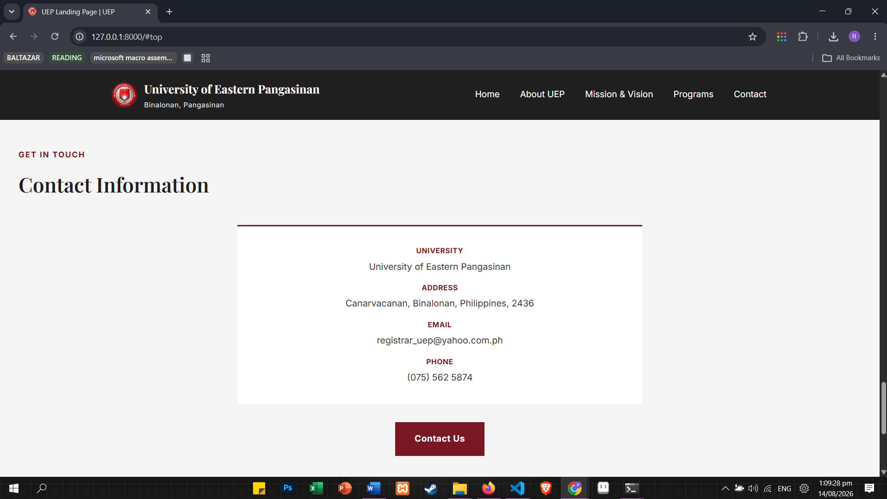
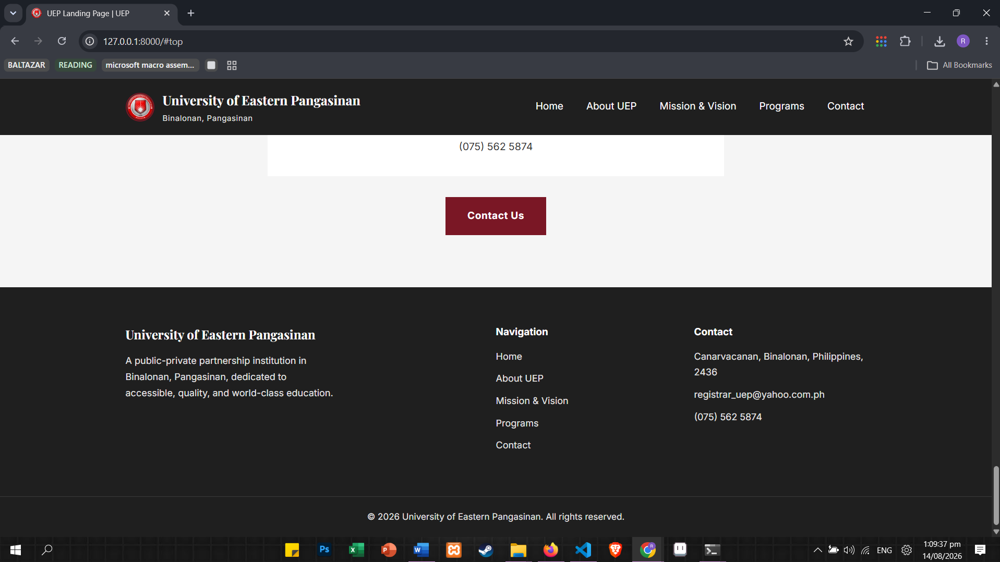

<div align="center">

# University of Eastern Pangasinan Landing Page

### Systems Integration and Architecture 1


</div>

---

## About

The **University of Eastern Pangasinan Landing Page** is a responsive university website built using Laravel Blade, Vite, HTML, and CSS.

The website presents information about UEP, including its history, mission and vision, academic programs, campus life, university highlights, and contact information.

This project was developed **for academic purposes** as part of the subject:

**Systems Integration and Architecture 1**

under the supervision of:

**RAYMARK UDAN**

---

## Features

* University-style landing page
* Full-width hero section
* UEP building background image
* About UEP section
* Mission and Vision section
* Academic Programs section
* University Highlights
* Campus Life section
* Contact Information
* Responsive design
* Reusable Blade header and footer
* Shared CSS styling
* Dynamic copyright year using Blade
* Solid maroon and dark color scheme
* No gradients

---

## Technologies

* Laravel
* PHP
* Blade
* HTML5
* CSS3
* Vite

---

## Project Structure

```text
resources/
├── views/
│   ├── layouts/
│   │   └── app.blade.php
│   ├── components/
│   │   ├── header.blade.php
│   │   └── footer.blade.php
│   └── welcome.blade.php
│
└── css/
    └── app.css

public/
└── images/
    └── uep-building.jpg
```

---

## Screenshots

### Header



### About UEP



### Mission and Vision



### Contact



### Footer



---

## Design

The website follows a traditional university-inspired design using a simple and formal color palette.

| Color          | Hex       |
| -------------- | --------- |
| Primary Maroon | `#7A1725` |
| Dark           | `#1F1F1F` |
| White          | `#FFFFFF` |
| Light Gray     | `#F5F5F5` |

The design uses solid colors instead of gradients to maintain a professional academic appearance.

---

## Installation

Clone the repository:

```bash
git clone <repository-url>
cd uep-landing-page
```

Install PHP dependencies:

```bash
composer install
```

Install frontend dependencies:

```bash
npm install
```

Create the environment file:

```bash
cp .env.example .env
```

Generate the application key:

```bash
php artisan key:generate
```

Run Vite:

```bash
npm run dev
```

Then run the Laravel application using your preferred local development environment.

---

## Blade Structure

The main layout uses reusable header and footer components:

```blade
@include('components.header')

@yield('content')

@include('components.footer')
```

The landing page extends the main layout:

```blade
@extends('layouts.app')

@section('title', 'UEP Landing Page')

@section('content')
    ...
@endsection
```

The footer automatically displays the current year:

```blade
{{ date('Y') }}
```

---

## Academic Information

**Subject:** Systems Integration and Architecture 1

**Purpose:** Academic Project

**Supervisor:** RAYMARK UDAN

**Institution:** University of Eastern Pangasinan

---

## Author

<div align="center">

### Renier Jhon

Bachelor of Science in Information Technology

University of Eastern Pangasinan

</div>
